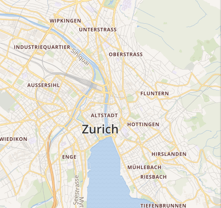
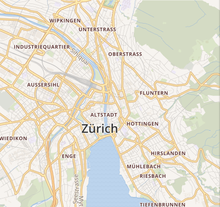
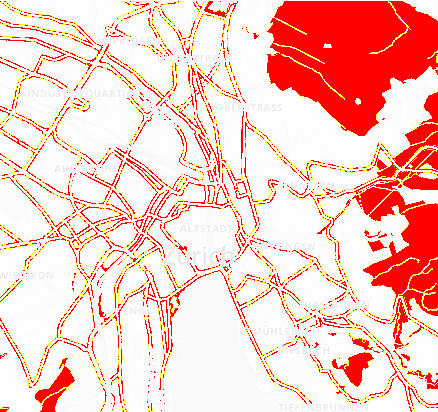

# pixelmatch

Diff images on CPU. Small, fast pixel-level image comparison library for e2e testing.

## Features

- Pixel-by-pixel image comparison
- Customizable threshold and colors for diff output
- Anti-aliasing detection
- Zero dependencies for image manipulations in flutter

| expected | actual | diff |
| --- | --- | --- |
|  |  |  |

## Getting started

In dart, give Uint8List with RGBA canvas to it somehow.

## Usage

```dart
import 'package:pixelmatch/pixelmatch.dart';
import 'dart:typed_data';

void main() {
  // Prepare your image data as RGBA Uint8Lists
  final img1 = Uint8List(width * height * 4); // First image
  final img2 = Uint8List(width * height * 4); // Second image
  final diff = Uint8List(width * height * 4); // Output diff (or null)

  // Compare images
  final numDiffPixels = pixelmatch(img1, img2, diff, width, height, { 'threshold': 0.1 });

  print('Found $numDiffPixels different pixels');
}
```

In flutter, yout can use additional utils for image manipulations.

```dart
import 'package:pixelmatch/utils.dart';

void main() async {
  // Load your Image objects from PNG files
  final img1 = readPng('path/to/image1.png');
  final img2 = readPng('path/to/image2.png');

  // Compare images using imgPixelmatch
  final (ratioDiff, rgbaDiff) = await imgPixelmatch(img1, img2, { 'threshold': 0.1 });

  // Print difference and save the generated diff image
  print('Difference ratio: $ratioDiff');
  writePng('path/to/diff.png', await rgbaToImg(rgbaDiff));
}
```

#### Options

- `threshold` (default: 0.1): Matching threshold (0 to 1); smaller is more sensitive
- `includeAA` (default: false): Whether to skip anti-aliasing detection
- `alpha` (default: 0.1): Opacity of original image in diff output
- `aaColor` (default: [255, 255, 0]): Color of anti-aliased pixels in diff output
- `diffColor` (default: [255, 0, 0]): Color of different pixels in diff output
- `diffColorAlt` (default: null): Alternative color for dark on light differences
- `diffMask` (default: false): Draw the diff over a transparent background

## Additional information

This is a Dart port of [mapbox/pixelmatch](https://github.com/mapbox/pixelmatch) with additional utils.